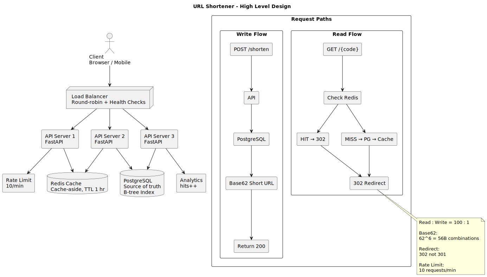
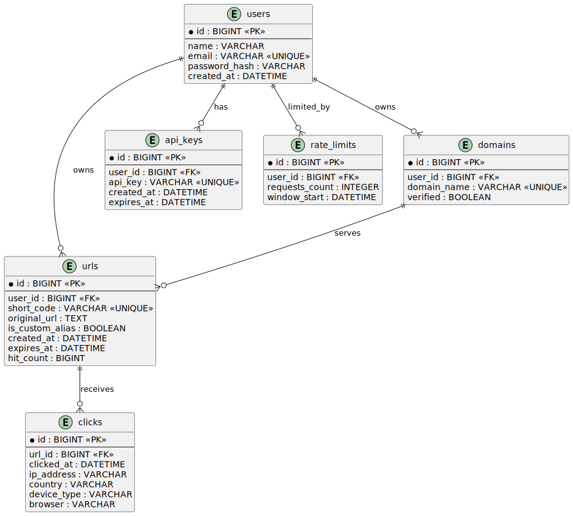

# 🔗 URL Shortener — Full Stack, Deployed Live

🚀 **Live Deployed App:** [https://url-shortener-production-4cb7.up.railway.app](https://url-shortener-production-4cb7.up.railway.app)

A production-grade, high-performance URL Shortener service written in **modern C++17** using the **Crow HTTP Framework**. Built with an **in-memory Cache-Aside engine**, **SQLite persistence**, **IP-based Rate Limiting**, and a modern **glassmorphic dashboard UI**.

---

## 🌟 System Design & Core Interview Concepts

This project implements industry-standard architectural patterns and covers key system design concepts frequently discussed in interviews:

### 1. Base62 Encoding vs. Hash Collisions (UUID/MD5)
* **The Design:** Instead of generating random hashes (which suffer from the birthday paradox and collisions), this service utilizes **Base62 encoding** (`[0-9][a-z][A-Z]`) derived from the auto-incrementing database ID.
* **Why Base62?** It guarantees 100% collision-free codes. 6 characters in Base62 can represent $62^6 \approx 56.8 \text{ Billion}$ unique short URLs, making it highly compact and URL-safe.

### 2. Cache-Aside Pattern (Hot Path Optimization)
* **The Design:** URL redirection is a read-heavy operation (typically a 100:1 read-to-write ratio). We implement the **Cache-Aside Pattern** using a thread-safe in-memory cache with a Time-To-Live (TTL) constraint.
* **Flow:** When a request for `/code` arrives:
  1. The server checks the in-memory cache first (**Cache Hit** $\rightarrow$ instant 302 redirect, $<1\text{ms}$).
  2. If missing (**Cache Miss**), it queries SQLite, populates the cache for future hits, and increments the database hit count.
* **Thread Safety:** Implemented with `std::mutex` and `std::lock_guard` to prevent race conditions during concurrent requests.

### 3. Sliding Window Rate Limiting (API Security)
* **The Design:** Prevents Denial of Service (DoS) and API brute-forcing. 
* **Flow:** Checks the requester's IP address against a thread-safe in-memory rate map. If the request count exceeds the limit within a 1-minute window, the server immediately rejects the connection with a `429 Too Many Requests` status, protecting the database from load spikes.

### 4. Ephemeral vs. Persistent Storage (Railway Volume)
* **The Design:** Container deployments (like Docker on Railway) are ephemeral—their filesystems are wiped on every redeploy. 
* **Solution:** We mount a **Railway Persistent Volume** at `/data` and configure SQLite to store the database file at `/data/urls.db`. This separates the compute (C++ server container) from the state (database storage), ensuring data is never lost during updates.

### 5. Load Balancing & Stateless Scaling
* **The Design:** Although SQLite is file-based and runs inside the container, the C++ Crow application itself is designed to be **stateless**.
* **Scaling:** In a large-scale system, the application instances sit behind a **Load Balancer** (like NGINX or AWS ALB), which distributes traffic across multiple replicas. In production, the SQLite database and in-memory cache can be swapped with centralized components (e.g., a **PostgreSQL Database** and a **Redis Cache**) to allow horizontal autoscaling without session or state issues.

---

## 🔒 Why Use Environment Variables?

In modern software engineering (specifically the **12-Factor App methodology**), configuration should be strictly separated from code. We use environment variables because:
1. **Security:** Sensitive values (like API keys, passwords, or database credentials) should never be hardcoded in git.
2. **Environment Decoupling:** The same compiled binary can run locally, in a staging environment, or in production (Railway) without changing a single line of code. We simply pass different environment variables at runtime.

| Variable Name | Purpose | Local Default | Production (Railway) |
|---|---|---|---|
| `PORT` | Network port the application binds to | `8080` | Assigned dynamically by Railway |
| `DB_PATH` | File path to write the SQLite database | `urls.db` | `/data/urls.db` (Persistent Volume) |
| `RATE_LIMIT_PER_MINUTE` | API requests allowed per minute per IP | `10` | Adjust based on API load thresholds |
| `BASE_URL` | Domain prefix used to generate short URLs | `http://localhost:8080` | `https://your-domain.up.railway.app` |

---

## 📐 System Architecture Diagrams

### High-Level Design (HLD) Flow
Shows how requests route through rate limiting, caching layers, and database queries:



### Entity-Relationship (ER) Schema
Shows the SQLite table structure optimized with a database index on the lookup key:



---

## 💻 Step-by-Step Local Setup Guide

Follow these instructions to download, compile, and run the project on your local Linux system:

### 1. Download/Clone the Project
Open your terminal and run the following command to download the repository:
```bash
git clone https://github.com/kanishk123agarwal/URL-Shortener.git
cd URL-Shortener
```

### 2. Install System Dependencies
Your system needs a C++17 compiler, CMake, SQLite3 libraries, and the ASIO header library.

**On Ubuntu / Debian / Mint:**
```bash
sudo apt update
sudo apt install -y g++ cmake libsqlite3-dev libasio-dev git
```

### 3. Build the Project
We use CMake to configure and build the application:
```bash
# Generate build files in a 'build' directory
cmake -B build -DCMAKE_BUILD_TYPE=Release .

# Compile the application (parallel build using all CPU cores)
cmake --build build --parallel $(nproc)
```

### 4. Run the Server
Once compiled, you can start the URL shortener directly:
```bash
./build/url_shortener
```
Open your browser and navigate to **[http://localhost:8080](http://localhost:8080)**.

### 5. Run the Automated Unit Tests
To verify all individual modules are operating correctly (Base62 encoder, database CRUD, cache eviction, and rate limiting):
```bash
./build/test_shortener
./build/test_database
./build/test_cache
./build/test_rate_limiter
```

---

## 🐳 Alternate Method: Running with Docker
If you have Docker and Docker Compose installed, you can launch the entire system in a containerized environment with one command:
```bash
# Build and run the container
docker compose up --build
```
The application will automatically build inside the container and bind to port `8080`.

---

## 🔮 Future Roadmap & Production Scaling

To scale this service to handle millions of daily active users, the following upgrades are planned:

1. **Distributed Caching (Redis):** Replace the local C++ standard map cache with a centralized **Redis** cluster. This allows horizontally scaled server instances to share a single, ultra-fast distributed cache.
2. **Distributed DB (PostgreSQL):** Move from SQLite (which locks the database file on writes) to **PostgreSQL/MySQL** to support high-concurrency writes and database replication.
3. **Advanced Analytics Dashboard:** Add visual charts (using Chart.js) to display click demographics, referrers, and device types over time.
4. **User Auth & Management:** Implement OAuth2 / JWT user authentication so registered users can manage, delete, or customize their link lifetime.
5. **Custom Link Expiry Policies:** Introduce automatic background cleanup workers to prune expired links from the database.
